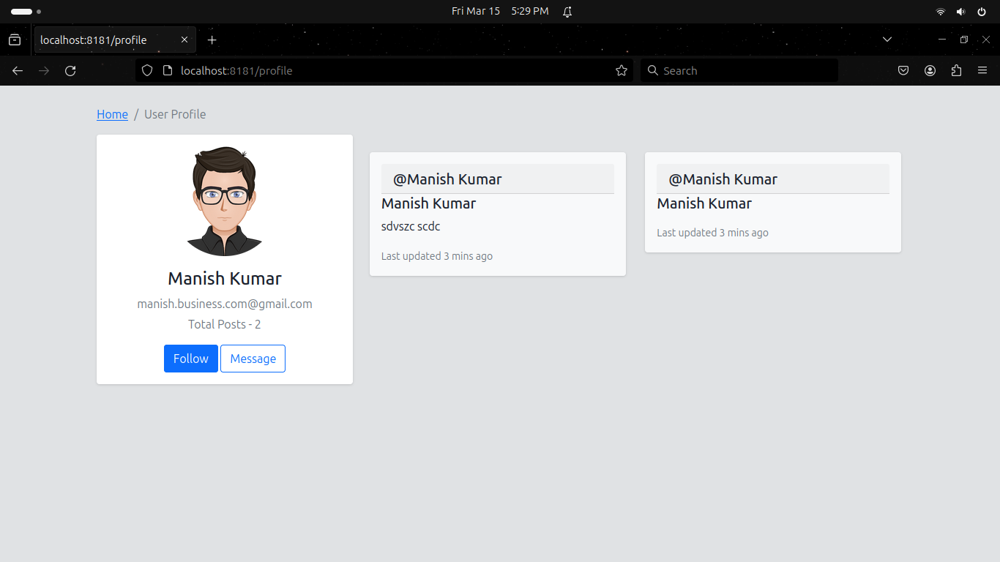
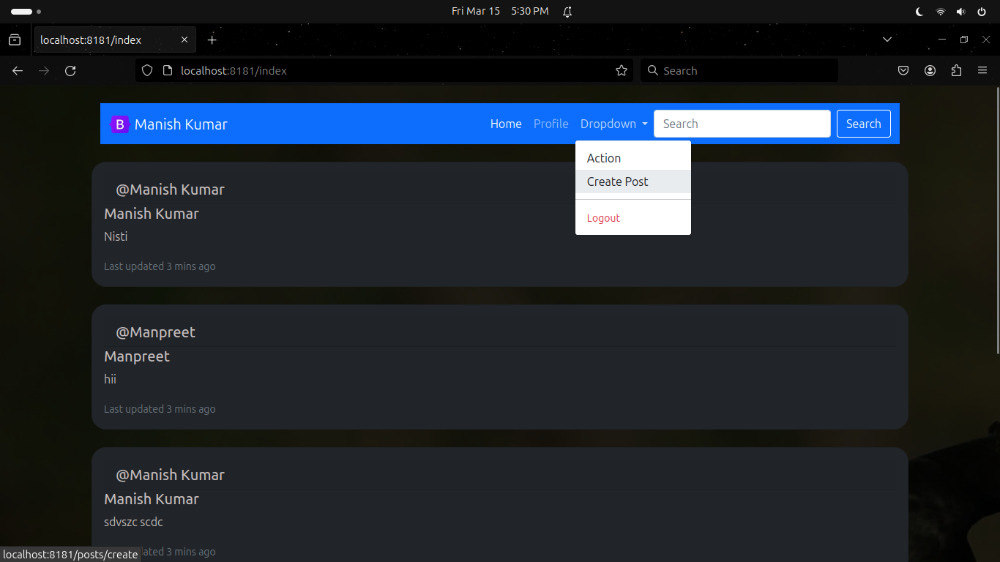
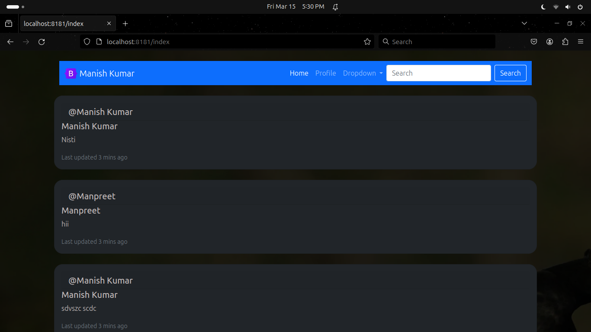

# Project Name

Description: [ a simple Blog Spring boot project!]

## Preview





## Features

- [Auth - Login , SignUp]
- [Post - edit , create , delete]
- [profile]

## Installation
### Prerequisites

- Java JDK [21 version]
- Maven [3+]

### Clone
Clone this repository to your local machine using:

```bash
git clone https://github.com/ig-imanish/ProjectX.git
```

### Setup

1. Open project in your IDE
2. Run the project

## WARNING

1. [This is not for commercial purpose, project may contains Bug & Errors]
